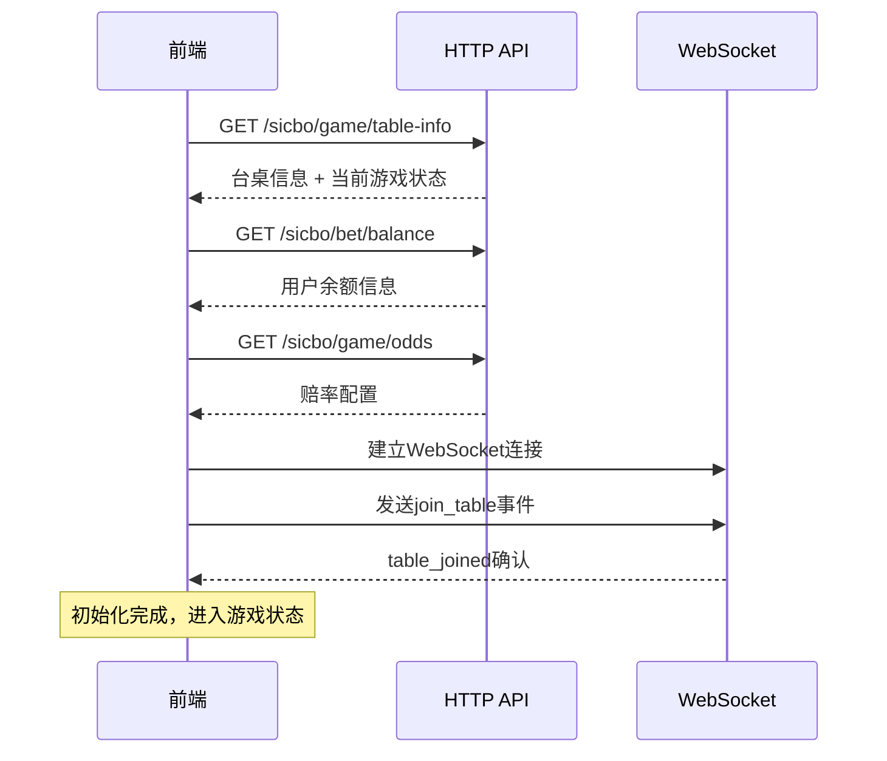
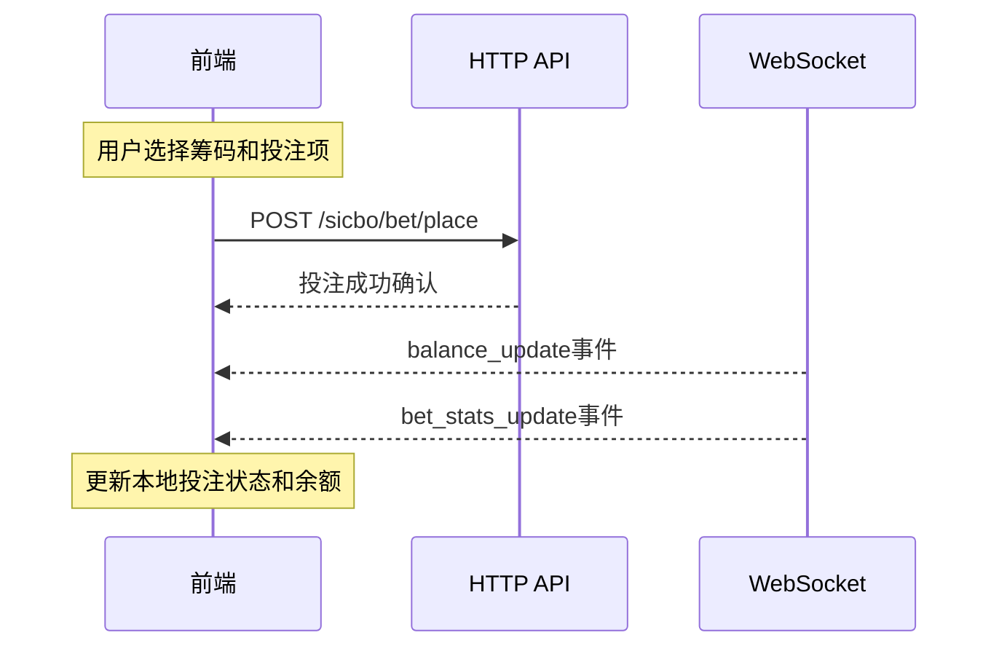
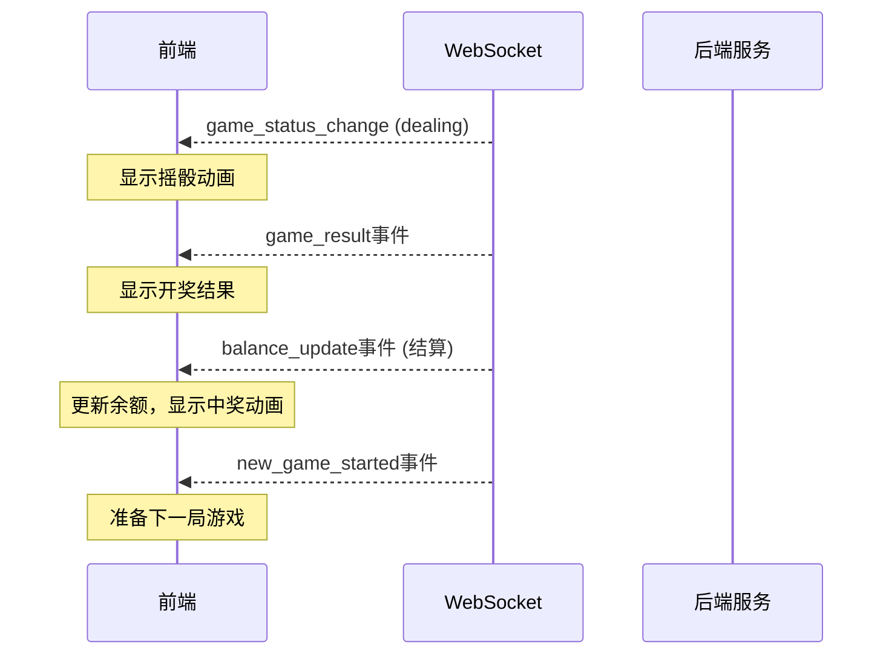

# 🎲 骰宝游戏前后端数据传输协议

## 📋 协议概述

本协议定义了骰宝游戏系统前后端之间的完整数据交互规范，包括HTTP API接口和WebSocket实时通信协议。

### 版本信息
- **协议版本**: v1.0
- **更新日期**: 2024-12-07
- **兼容性**: Vue3前端 + PHP后端

## 🌐 HTTP API 协议

### 基础规范

#### 请求格式
```typescript
// 请求头
headers: {
  'Content-Type': 'application/json',
  'Authorization': 'Bearer {token}',  // 可选
  'X-User-ID': '{user_id}',          // 用户ID
  'X-Table-ID': '{table_id}',        // 台桌ID（游戏相关接口必填）
}

// 通用请求参数
interface BaseRequest {
  timestamp?: number;     // 请求时间戳
  request_id?: string;    // 请求ID（用于追踪）
}
```

#### 响应格式
```typescript
interface ApiResponse<T = any> {
  success: boolean;       // 请求是否成功
  code: number;          // 状态码 200=成功
  message: string;       // 消息描述
  data?: T;             // 响应数据
  timestamp: number;     // 服务器时间戳
  request_id?: string;   // 对应的请求ID
  error?: {             // 错误详情（失败时）
    type: string;
    details?: any;
  };
}
```

---

## 🎮 游戏核心接口

### 1. 台桌信息

#### 1.1 获取台桌信息
```typescript
// GET /sicbo/game/table-info?table_id={table_id}
interface TableInfoRequest {
  table_id: number;
}

interface TableInfoResponse {
  table_id: number;
  table_name: string;
  status: 0 | 1 | 2;           // 0=关闭 1=开放 2=维护
  run_status: 0 | 1 | 2;       // 0=等待 1=投注中 2=开奖中
  game_config: {
    betting_time: number;       // 投注时长(秒)
    dice_rolling_time: number;  // 摇骰时长(秒)
    result_display_time: number; // 结果展示时长(秒)
    limits: {
      min_bet_basic: number;    // 基础投注最小额
      max_bet_basic: number;    // 基础投注最大额
      min_bet_total: number;    // 点数投注最小额
      max_bet_total: number;    // 点数投注最大额
    };
  };
  current_game?: {             // 当前游戏（如果有）
    game_number: string;
    round_number: number;
    status: 'betting' | 'dealing' | 'result';
    countdown: number;         // 剩余秒数
    betting_start_time: number;
    betting_end_time: number;
  };
  latest_result?: GameResult;  // 最新开奖结果
  today_stats: {
    total_rounds: number;
    big_count: number;
    small_count: number;
    odd_count: number;
    even_count: number;
  };
}
```

#### 1.2 获取游戏历史
```typescript
// GET /sicbo/game/history?table_id={table_id}&limit=20
interface GameHistoryRequest {
  table_id: number;
  limit?: number;             // 默认20，最大100
  start_date?: string;        // YYYY-MM-DD
  end_date?: string;          // YYYY-MM-DD
}

interface GameHistoryResponse {
  table_id: number;
  history: GameResult[];
  count: number;
  has_more: boolean;
}

interface GameResult {
  game_number: string;
  round_number: number;
  dice1: 1 | 2 | 3 | 4 | 5 | 6;
  dice2: 1 | 2 | 3 | 4 | 5 | 6;
  dice3: 1 | 2 | 3 | 4 | 5 | 6;
  total_points: number;       // 3-18
  is_big: boolean;           // true=大(11-17) false=小(4-10)
  is_odd: boolean;           // true=单 false=双
  has_triple: boolean;       // 是否三同号
  triple_number?: 1 | 2 | 3 | 4 | 5 | 6; // 三同号数字
  has_pair: boolean;         // 是否有对子
  pair_numbers?: number[];   // 对子数字数组
  winning_bets: string[];    // 中奖投注类型
  created_at: string;        // ISO时间字符串
}
```

### 2. 投注接口

#### 2.1 提交投注
```typescript
// POST /sicbo/bet/place
interface PlaceBetRequest {
  table_id: number;
  game_number: string;
  bets: BetItem[];
  total_amount: number;
}

interface BetItem {
  bet_type: BetType;
  bet_amount: number;
}

type BetType = 
  // 基础投注
  | 'small' | 'big' | 'odd' | 'even'
  // 点数投注
  | 'total-4' | 'total-5' | 'total-6' | 'total-7' | 'total-8' | 'total-9'
  | 'total-10' | 'total-11' | 'total-12' | 'total-13' | 'total-14' | 'total-15'
  | 'total-16' | 'total-17'
  // 单骰投注
  | 'single-1' | 'single-2' | 'single-3' | 'single-4' | 'single-5' | 'single-6'
  // 对子投注
  | 'pair-1' | 'pair-2' | 'pair-3' | 'pair-4' | 'pair-5' | 'pair-6'
  // 三同号投注
  | 'triple-1' | 'triple-2' | 'triple-3' | 'triple-4' | 'triple-5' | 'triple-6'
  | 'any-triple'
  // 组合投注
  | 'combo-1-2' | 'combo-1-3' | 'combo-1-4' | 'combo-1-5' | 'combo-1-6'
  | 'combo-2-3' | 'combo-2-4' | 'combo-2-5' | 'combo-2-6'
  | 'combo-3-4' | 'combo-3-5' | 'combo-3-6'
  | 'combo-4-5' | 'combo-4-6' | 'combo-5-6';

interface PlaceBetResponse {
  bet_id: string;            // 投注记录ID
  game_number: string;
  total_amount: number;
  new_balance: number;       // 用户新余额
  bets: Array<{
    bet_type: BetType;
    bet_amount: number;
    odds: number;
    potential_win: number;   // 潜在中奖金额
  }>;
  bet_time: string;          // 投注时间
}
```

#### 2.2 获取当前投注
```typescript
// GET /sicbo/bet/current?table_id={table_id}&game_number={game_number}
interface CurrentBetsRequest {
  table_id: number;
  game_number: string;
}

interface CurrentBetsResponse {
  game_number: string;
  bets: Array<{
    bet_type: BetType;
    bet_amount: number;
    odds: number;
    potential_win: number;
    bet_time: string;
  }>;
  total_amount: number;
  bet_count: number;
}
```

#### 2.3 取消投注
```typescript
// DELETE /sicbo/bet/cancel
interface CancelBetRequest {
  table_id: number;
  game_number: string;
}

interface CancelBetResponse {
  refund_amount: number;
  current_balance: number;
}
```

### 3. 用户余额

#### 3.1 获取余额信息
```typescript
// GET /sicbo/bet/balance
interface BalanceResponse {
  total_balance: number;     // 总余额
  frozen_amount: number;     // 冻结金额
  available_balance: number; // 可用余额
  currency: string;          // 货币单位
  last_update: string;       // 最后更新时间
}
```

### 4. 赔率信息

#### 4.1 获取赔率配置
```typescript
// GET /sicbo/game/odds
interface OddsResponse {
  table_id?: number;
  odds: Record<string, OddsInfo[]>; // 按分类组织
  update_time: number;
}

interface OddsInfo {
  bet_type: BetType;
  bet_name: string;
  odds: number;
  min_bet: number;
  max_bet: number;
  probability?: number;      // 理论概率
}

// 赔率数据结构示例
{
  "basic": [
    { "bet_type": "small", "bet_name": "小", "odds": 1.0, "min_bet": 10, "max_bet": 50000 },
    { "bet_type": "big", "bet_name": "大", "odds": 1.0, "min_bet": 10, "max_bet": 50000 }
  ],
  "total": [
    { "bet_type": "total-4", "bet_name": "总和4", "odds": 60.0, "min_bet": 10, "max_bet": 1000 }
  ],
  "single": [...],
  "pair": [...],
  "triple": [...],
  "combo": [...]
}
```

---

## 🔌 WebSocket 实时通信协议

### 连接规范

#### 连接URL
```
ws://domain.com/ws?table_id={table_id}&user_id={user_id}&token={token}
```

#### 消息格式
```typescript
interface WebSocketMessage<T = any> {
  event: string;             // 事件类型
  data: T;                  // 事件数据
  timestamp: number;        // 时间戳
  message_id?: string;      // 消息ID
}
```

### 客户端发送事件

#### 1. 加入台桌
```typescript
// 客户端 -> 服务端
interface JoinTableEvent {
  event: 'join_table';
  data: {
    table_id: number;
    user_id: number;
    token: string;
  };
}
```

#### 2. 心跳检测
```typescript
// 客户端 -> 服务端（每30秒）
interface HeartbeatEvent {
  event: 'heartbeat';
  data: {
    timestamp: number;
  };
}
```

### 服务端推送事件

#### 1. 连接确认
```typescript
// 服务端 -> 客户端
interface TableJoinedEvent {
  event: 'table_joined';
  data: {
    table_id: number;
    user_id: number;
    current_game?: {
      game_number: string;
      status: 'waiting' | 'betting' | 'dealing' | 'result';
      countdown: number;
      round: number;
    };
    user_balance: number;
    table_info: {
      table_name: string;
      min_bet: number;
      max_bet: number;
    };
  };
}
```

#### 2. 新游戏开始
```typescript
interface NewGameStartedEvent {
  event: 'new_game_started';
  data: {
    table_id: number;
    game_number: string;
    status: 'betting';
    countdown: number;
    round: number;
    betting_end_time: number;
  };
}
```

#### 3. 游戏状态变化
```typescript
interface GameStatusChangeEvent {
  event: 'game_status_change';
  data: {
    table_id: number;
    game_number: string;
    status: 'waiting' | 'betting' | 'dealing' | 'result';
    countdown: number;
  };
}
```

#### 4. 倒计时更新
```typescript
interface CountdownTickEvent {
  event: 'countdown_tick';
  data: {
    table_id: number;
    countdown: number;
    status: 'betting' | 'dealing' | 'result';
  };
}
```

#### 5. 开奖结果
```typescript
interface GameResultEvent {
  event: 'game_result';
  data: {
    table_id: number;
    game_number: string;
    dice_results: [number, number, number];
    total: number;
    is_big: boolean;
    is_odd: boolean;
    special_results: Array<{
      type: string;
      description: string;
    }>;
    winning_bets: string[];
    timestamp: string;
  };
}
```

#### 6. 用户余额更新
```typescript
interface BalanceUpdateEvent {
  event: 'balance_update';
  data: {
    user_id: number;
    balance: number;
    change: number;         // 变动金额（正数=增加，负数=减少）
    reason: 'bet_placed' | 'win_settlement' | 'lose_settlement' | 'refund';
    game_number?: string;
    related_bet?: {
      bet_type: BetType;
      bet_amount: number;
      win_amount?: number;
    };
  };
}
```

#### 7. 投注统计更新
```typescript
interface BetStatsUpdateEvent {
  event: 'bet_stats_update';
  data: {
    table_id: number;
    game_number: string;
    stats: Record<BetType, {
      total_amount: number;
      bet_count: number;
    }>;
  };
}
```

#### 8. 错误信息
```typescript
interface ErrorEvent {
  event: 'error';
  data: {
    code: string;
    message: string;
    details?: any;
  };
}

// 错误代码
type ErrorCode = 
  | 'INSUFFICIENT_BALANCE'    // 余额不足
  | 'INVALID_TOKEN'          // 令牌无效
  | 'BETTING_CLOSED'         // 投注已关闭
  | 'INVALID_BET_TYPE'       // 无效投注类型
  | 'BET_AMOUNT_INVALID'     // 投注金额无效
  | 'GAME_NOT_FOUND'         // 游戏不存在
  | 'TABLE_MAINTENANCE'      // 台桌维护中
  | 'USER_LIMIT_EXCEEDED'    // 用户限额超出
  | 'NETWORK_ERROR'          // 网络错误
  | 'SERVER_ERROR';          // 服务器错误
```

---

## 📊 数据状态管理

### 前端状态结构

#### 游戏状态
```typescript
interface GameState {
  // 台桌信息
  tableInfo: {
    table_id: number;
    table_name: string;
    status: number;
    run_status: number;
    game_config: any;
  };
  
  // 当前游戏
  currentGame: {
    game_number: string;
    round_number: number;
    status: 'waiting' | 'betting' | 'dealing' | 'result';
    countdown: number;
    betting_end_time: number;
  } | null;
  
  // 用户信息
  user: {
    user_id: number;
    balance: number;
    frozen_amount: number;
    available_balance: number;
  };
  
  // 投注状态
  betting: {
    selectedChip: number;           // 选中筹码面值
    currentBets: Record<BetType, number>; // 当前投注
    totalAmount: number;            // 投注总额
    lastBets: Record<BetType, number>;    // 上次投注记录
  };
  
  // 游戏历史
  gameHistory: GameResult[];
  
  // 赔率信息
  odds: Record<string, OddsInfo[]>;
  
  // 连接状态
  connection: {
    status: 'connected' | 'connecting' | 'disconnected' | 'reconnecting';
    last_heartbeat: number;
    reconnect_count: number;
  };
  
  // 设置
  settings: {
    sound_enabled: boolean;
    vibration_enabled: boolean;
    auto_bet_enabled: boolean;
  };
}
```

### 状态更新时机

#### 1. HTTP请求更新
- 页面初始化：调用台桌信息接口
- 用户投注：调用投注接口并更新本地状态
- 手动刷新：重新获取最新数据

#### 2. WebSocket推送更新
- 实时倒计时：每秒更新countdown
- 游戏状态变化：更新currentGame.status
- 开奖结果：更新gameHistory，清空currentBets
- 余额变化：更新user.balance

---

## 🔄 典型业务流程

### 1. 页面初始化流程


### 2. 用户投注流程


### 3. 开奖结算流程


---

## 🛡️ 错误处理机制

### 1. HTTP接口错误
```typescript
// 统一错误处理
interface ApiError {
  success: false;
  code: number;
  message: string;
  error: {
    type: string;
    details?: any;
  };
}

// 常见错误码
const ErrorCodes = {
  400: 'BAD_REQUEST',        // 请求参数错误
  401: 'UNAUTHORIZED',       // 未授权
  403: 'FORBIDDEN',          // 无权限
  404: 'NOT_FOUND',         // 资源不存在
  429: 'RATE_LIMITED',      // 请求频率限制
  500: 'SERVER_ERROR',      // 服务器错误
  503: 'SERVICE_UNAVAILABLE' // 服务不可用
};
```

### 2. WebSocket错误处理
```typescript
// 连接错误处理
interface ConnectionError {
  type: 'connection_lost' | 'auth_failed' | 'server_error';
  message: string;
  auto_reconnect: boolean;
  retry_delay: number;
}

// 重连策略
const ReconnectStrategy = {
  max_attempts: 5,
  base_delay: 1000,      // 1秒
  max_delay: 30000,      // 30秒
  backoff_factor: 2      // 指数退避
};
```

---

## 📝 开发注意事项

### 1. 前端开发要点
- **状态同步**：确保HTTP和WebSocket数据的一致性
- **离线处理**：网络断开时的降级策略
- **性能优化**：避免频繁的状态更新和重渲染
- **错误边界**：完善的错误捕获和用户提示

### 2. 后端开发要点
- **数据一致性**：确保数据库和缓存的同步
- **并发控制**：处理同时投注的竞态条件
- **性能监控**：WebSocket连接数和消息频率监控
- **安全验证**：所有接口的权限和参数验证

### 3. 接口版本控制
```typescript
// URL版本控制
const API_ENDPOINTS = {
  v1: {
    base: '/api/v1/sicbo',
    websocket: '/ws/v1'
  }
};

// 响应头版本信息
headers: {
  'X-API-Version': '1.0',
  'X-Protocol-Version': '1.0'
}
```

---

## 🧪 测试用例

### 1. HTTP接口测试
```bash
# 获取台桌信息
curl -H "X-User-ID: 1" -H "X-Table-ID: 1" \
  "http://localhost/sicbo/game/table-info?table_id=1"

# 提交投注
curl -X POST -H "Content-Type: application/json" \
  -H "X-User-ID: 1" -H "X-Table-ID: 1" \
  -d '{"table_id":1,"game_number":"T001","bets":[{"bet_type":"big","bet_amount":100}],"total_amount":100}' \
  "http://localhost/sicbo/bet/place"
```

### 2. WebSocket测试
```javascript
// 连接测试
const ws = new WebSocket('ws://localhost/ws?table_id=1&user_id=1&token=test');

// 发送加入台桌
ws.send(JSON.stringify({
  event: 'join_table',
  data: { table_id: 1, user_id: 1, token: 'test' }
}));

// 监听消息
ws.onmessage = (event) => {
  const message = JSON.parse(event.data);
  console.log('收到消息:', message);
};
```

---

这个协议文档提供了完整的前后端对接规范，开发者可以根据这个协议进行开发，确保数据传输的一致性和可靠性。