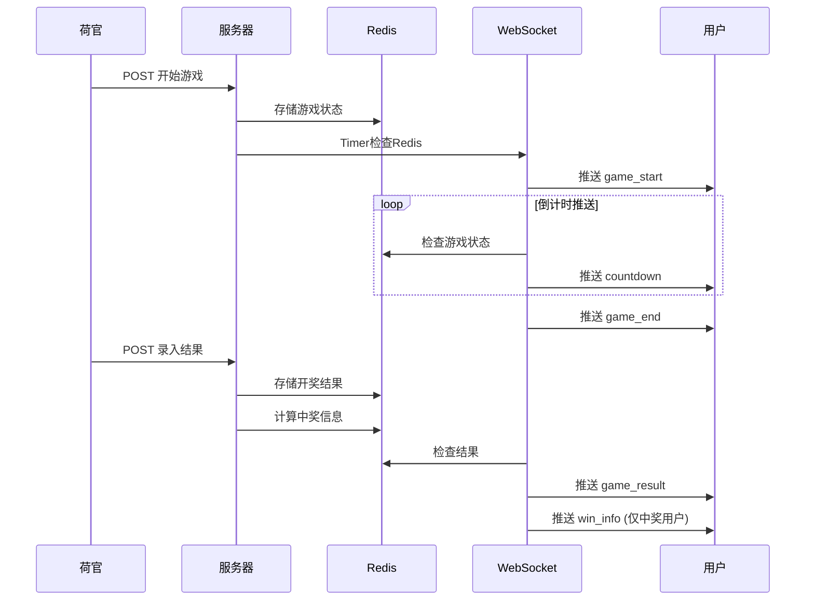
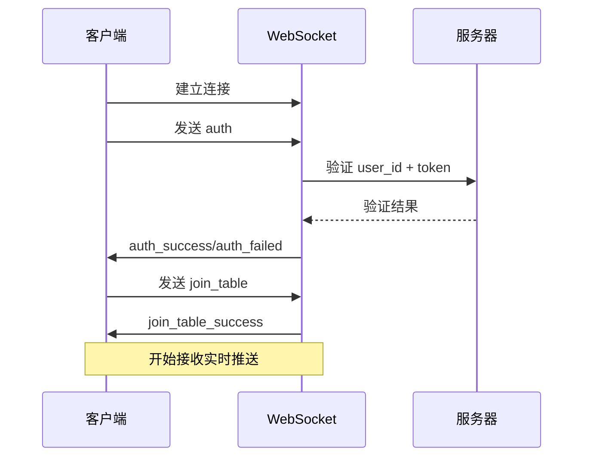

# 🎲 骰宝游戏数据传输协议 - 简化版

## 📋 协议概述

本协议定义了骰宝游戏系统前后端之间的数据交互规范，采用**HTTP API + WebSocket实时推送**的架构模式。

### 版本信息
- **协议版本**: v2.0
- **更新日期**: 2024-12-07
- **架构**: HTTP API负责数据操作，WebSocket负责实时推送

### 🎯 功能分工

**HTTP API 负责：**
- 用户投注操作
- 投注历史查询
- 用户余额查询
- 台桌信息查询
- 游戏历史查询
- 赔率信息查询
- 荷官操作（开始游戏、录入结果）

**WebSocket 负责：**
- 实时游戏状态推送
- 倒计时推送
- 开奖结果推送
- 个人中奖信息推送

---

## 🌐 HTTP API 协议

### 基础规范

#### 请求格式
```typescript
// 请求头
headers: {
  'Content-Type': 'application/json',
  'X-User-ID': '{user_id}',          // 用户ID
  'X-Table-ID': '{table_id}',        // 台桌ID（游戏相关接口必填）
}

// 通用请求参数
interface BaseRequest {
  timestamp?: number;     // 请求时间戳
  request_id?: string;    // 请求ID（用于追踪）
}
```

#### 响应格式
```typescript
interface ApiResponse<T = any> {
  code: number;          // 状态码 200=成功
  message: string;       // 消息描述
  data?: T;             // 响应数据
  timestamp: number;     // 服务器时间戳
}
```

---

## 🎮 游戏核心接口

### 1. 台桌信息

#### 1.1 获取台桌信息
```typescript
// GET /sicbo/game/table-info?table_id={table_id}
interface TableInfoResponse {
  table_id: number;
  table_name: string;
  status: 0 | 1 | 2;           // 0=关闭 1=开放 2=维护
  run_status: 0 | 1 | 2;       // 0=等待 1=投注中 2=开奖中
  game_config: {
    betting_time: number;       // 投注时长(秒)
    limits: {
      min_bet: number;          // 最小投注额
      max_bet: number;          // 最大投注额
    };
  };
  current_game?: {             // 当前游戏（如果有）
    game_number: string;
    round_number: number;
    status: 'waiting' | 'betting' | 'dealing' | 'result';
    countdown: number;         // 剩余秒数
  };
  latest_result?: GameResult;  // 最新开奖结果
}
```

#### 1.2 获取游戏历史
```typescript
// GET /sicbo/game/history?table_id={table_id}&limit=20
interface GameHistoryResponse {
  table_id: number;
  history: GameResult[];
  count: number;
}

interface GameResult {
  game_number: string;
  round_number: number;
  dice1: 1 | 2 | 3 | 4 | 5 | 6;
  dice2: 1 | 2 | 3 | 4 | 5 | 6;
  dice3: 1 | 2 | 3 | 4 | 5 | 6;
  total_points: number;       // 3-18
  is_big: boolean;           // true=大(11-17) false=小(4-10)
  is_odd: boolean;           // true=单 false=双
  has_triple: boolean;       // 是否三同号
  triple_number?: 1 | 2 | 3 | 4 | 5 | 6; // 三同号数字
  winning_bets: string[];    // 中奖投注类型
  created_at: string;        // ISO时间字符串
}
```

### 2. 投注接口

#### 2.1 提交投注
```typescript
// POST /sicbo/bet/place
interface PlaceBetRequest {
  table_id: number;
  game_number: string;
  bets: BetItem[];
  total_amount: number;
}

interface BetItem {
  bet_type: BetType;
  bet_amount: number;
}

type BetType = 
  // 基础投注
  | 'small' | 'big' | 'odd' | 'even'
  // 点数投注
  | 'total-4' | 'total-5' | 'total-6' | 'total-7' | 'total-8' | 'total-9'
  | 'total-10' | 'total-11' | 'total-12' | 'total-13' | 'total-14' | 'total-15'
  | 'total-16' | 'total-17'
  // 单骰投注
  | 'single-1' | 'single-2' | 'single-3' | 'single-4' | 'single-5' | 'single-6'
  // 对子投注
  | 'pair-1' | 'pair-2' | 'pair-3' | 'pair-4' | 'pair-5' | 'pair-6'
  // 三同号投注
  | 'triple-1' | 'triple-2' | 'triple-3' | 'triple-4' | 'triple-5' | 'triple-6'
  | 'any-triple'
  // 组合投注
  | 'combo-1-2' | 'combo-1-3' | 'combo-1-4' | 'combo-1-5' | 'combo-1-6'
  | 'combo-2-3' | 'combo-2-4' | 'combo-2-5' | 'combo-2-6'
  | 'combo-3-4' | 'combo-3-5' | 'combo-3-6'
  | 'combo-4-5' | 'combo-4-6' | 'combo-5-6';

interface PlaceBetResponse {
  bet_id: string;            // 投注记录ID
  game_number: string;
  total_amount: number;
  new_balance: number;       // 用户新余额
  bets: Array<{
    bet_type: BetType;
    bet_amount: number;
    odds: number;
    potential_win: number;   // 潜在中奖金额
  }>;
  bet_time: string;          // 投注时间
}
```

#### 2.2 获取当前投注
```typescript
// GET /sicbo/bet/current?table_id={table_id}&game_number={game_number}
interface CurrentBetsResponse {
  game_number: string;
  bets: Array<{
    bet_type: BetType;
    bet_amount: number;
    odds: number;
    potential_win: number;
    bet_time: string;
  }>;
  total_amount: number;
  bet_count: number;
}
```

#### 2.3 取消投注
```typescript
// DELETE /sicbo/bet/cancel
interface CancelBetRequest {
  table_id: number;
  game_number: string;
}

interface CancelBetResponse {
  refund_amount: number;
  current_balance: number;
}
```

### 3. 用户余额

#### 3.1 获取余额信息
```typescript
// GET /sicbo/bet/balance
interface BalanceResponse {
  total_balance: number;     // 总余额
  frozen_amount: number;     // 冻结金额
  available_balance: number; // 可用余额
  currency: string;          // 货币单位
  last_update: string;       // 最后更新时间
}
```

### 4. 赔率信息

#### 4.1 获取赔率配置
```typescript
// GET /sicbo/game/odds
interface OddsResponse {
  table_id?: number;
  odds: Record<string, OddsInfo[]>; // 按分类组织
  update_time: number;
}

interface OddsInfo {
  bet_type: BetType;
  bet_name: string;
  odds: number;
  min_bet: number;
  max_bet: number;
}
```

### 5. 荷官操作接口

#### 5.1 开始新游戏
```typescript
// POST /sicbo/admin/dealer/start-game
interface StartGameRequest {
  table_id: number;
  betting_time: number;     // 投注时长(秒)
}

interface StartGameResponse {
  game_number: string;
  table_id: number;
  betting_time: number;
  start_time: number;       // 开始时间戳
}
```

#### 5.2 录入开奖结果
```typescript
// POST /sicbo/admin/dealer/input-result
interface InputResultRequest {
  table_id: number;
  game_number: string;
  dice1: 1 | 2 | 3 | 4 | 5 | 6;
  dice2: 1 | 2 | 3 | 4 | 5 | 6;
  dice3: 1 | 2 | 3 | 4 | 5 | 6;
}

interface InputResultResponse {
  game_number: string;
  result_id: number;
  dice1: number;
  dice2: number;
  dice3: number;
  total_points: number;
  is_big: boolean;
  is_odd: boolean;
  winning_bets: string[];
}
```

---

## 🔌 WebSocket 实时推送协议

### 连接规范

#### 连接URL
```
ws://domain.com/ws?table_id={table_id}&user_id={user_id}&token={token}
```

#### 消息格式
```typescript
interface WebSocketMessage<T = any> {
  type: string;             // 事件类型
  data: T;                  // 事件数据
  timestamp: number;        // 时间戳
}
```

### 客户端发送事件

#### 1. 用户认证
```typescript
// 客户端 -> 服务端
interface AuthEvent {
  type: 'auth';
  user_id: number;
  token: string;
}
```

#### 2. 加入台桌
```typescript
// 客户端 -> 服务端
interface JoinTableEvent {
  type: 'join_table';
  table_id: number;
}
```

#### 3. 离开台桌
```typescript
// 客户端 -> 服务端
interface LeaveTableEvent {
  type: 'leave_table';
}
```

#### 4. 心跳检测
```typescript
// 客户端 -> 服务端（每30秒）
interface PingEvent {
  type: 'ping';
}
```

### 服务端推送事件

#### 1. 认证响应
```typescript
// 服务端 -> 客户端
interface AuthSuccessEvent {
  type: 'auth_success';
  data: {
    user_id: number;
    message: string;
  };
}

interface AuthFailedEvent {
  type: 'auth_failed';
  data: {
    message: string;
  };
}
```

#### 2. 台桌加入响应
```typescript
// 服务端 -> 客户端
interface JoinTableSuccessEvent {
  type: 'join_table_success';
  data: {
    table_id: number;
    table_name: string;
    online_count: number;
    current_game?: {
      game_number: string;
      status: 'waiting' | 'betting' | 'dealing' | 'result';
      countdown: number;
    };
  };
}
```

#### 3. 开始投注推送
```typescript
// 服务端 -> 客户端
interface GameStartEvent {
  type: 'game_start';
  data: {
    table_id: number;
    game_number: string;
    round_number: number;
    total_time: number;       // 总投注时间(秒)
    start_time: number;       // 开始时间戳
    message: string;          // "开始投注"
  };
}
```

#### 4. 倒计时推送
```typescript
// 服务端 -> 客户端
interface CountdownEvent {
  type: 'countdown';
  data: {
    table_id: number;
    remaining_time: number;   // 剩余秒数
    total_time: number;       // 总时长
    message: string;          // "剩余X秒"
  };
}

// 推送时机：
// - 30秒 → 20秒 → 10秒 (每10秒推送)
// - 5秒 → 4秒 → 3秒 → 2秒 → 1秒 → 0秒 (最后5秒逐秒推送)
```

#### 5. 停止投注推送
```typescript
// 服务端 -> 客户端
interface GameEndEvent {
  type: 'game_end';
  data: {
    table_id: number;
    game_number: string;
    message: string;          // "停止投注"
    end_time: number;         // 结束时间戳
  };
}
```

#### 6. 开奖结果推送
```typescript
// 服务端 -> 客户端
interface GameResultEvent {
  type: 'game_result';
  data: {
    table_id: number;
    game_number: string;
    round_number: number;
    dice1: 1 | 2 | 3 | 4 | 5 | 6;
    dice2: 1 | 2 | 3 | 4 | 5 | 6;
    dice3: 1 | 2 | 3 | 4 | 5 | 6;
    total_points: number;     // 3-18
    is_big: boolean;          // true=大 false=小
    is_odd: boolean;          // true=单 false=双
    has_triple: boolean;      // 是否三同号
    triple_number?: number;   // 三同号数字
    winning_bets: string[];   // 中奖投注类型
    result_time: number;      // 开奖时间戳
  };
}
```

#### 7. 个人中奖信息推送
```typescript
// 服务端 -> 中奖用户
interface WinInfoEvent {
  type: 'win_info';
  data: {
    user_id: number;
    game_number: string;
    win_amount: number;       // 中奖金额
    win_bets: Array<{         // 中奖投注详情
      bet_type: string;
      bet_amount: number;
      odds: number;
      win_amount: number;
    }>;
    new_balance: number;      // 更新后余额
    message: string;          // "恭喜中奖"
  };
}
```

#### 8. 心跳响应
```typescript
// 服务端 -> 客户端
interface PongEvent {
  type: 'pong';
  data: {
    timestamp: number;
    server_time: string;
  };
}
```

#### 9. 错误消息
```typescript
// 服务端 -> 客户端
interface ErrorEvent {
  type: 'error';
  data: {
    code: string;
    message: string;
  };
}

// 错误代码
type ErrorCode = 
  | 'INVALID_TOKEN'          // 令牌无效
  | 'TABLE_NOT_FOUND'        // 台桌不存在
  | 'TABLE_UNAVAILABLE'      // 台桌不可用
  | 'NETWORK_ERROR'          // 网络错误
  | 'SERVER_ERROR';          // 服务器错误
```

---

## 📊 Redis数据结构

### 游戏状态存储
```redis
# 游戏状态
sicbo:table:{table_id}:status = {
  "game_number": "T001_20241207_143022_001",
  "status": "betting",           # waiting/betting/dealing/result
  "start_time": 1701936622,
  "total_time": 30,
  "table_id": 1,
  "round_number": 1
}

# 开奖结果
sicbo:table:{table_id}:result:{game_number} = {
  "dice1": 3,
  "dice2": 5,
  "dice3": 2,
  "total_points": 10,
  "is_big": false,
  "is_odd": false,
  "has_triple": false,
  "winning_bets": ["small", "even"],
  "result_time": 1701936652
}

# 个人中奖信息
sicbo:user:{user_id}:win:{game_number} = {
  "user_id": 123,
  "win_amount": 200.00,
  "win_bets": [
    {
      "bet_type": "small",
      "bet_amount": 100,
      "odds": 1.0,
      "win_amount": 100
    }
  ],
  "new_balance": 1200.00
}
```

---

## 🔄 典型业务流程

### 1. 完整游戏流程


### 2. 用户连接流程


---

## 🎯 关键设计原则

### 1. 职责分离
- **HTTP API**: 数据操作和查询
- **WebSocket**: 实时状态推送
- **Redis**: 游戏状态存储

### 2. 推送优化
- **倒计时**: 关键时间点推送，减少网络负载
- **个人推送**: 中奖信息只推送给相关用户
- **心跳机制**: 保持连接活跃

### 3. 数据一致性
- **单一数据源**: Redis作为游戏状态的唯一来源
- **定时检查**: WebSocket定时器检查Redis状态变化
- **错误恢复**: 连接断开后可重新获取当前状态

### 4. 性能考虑
- **连接复用**: 一个用户一个WebSocket连接
- **分台桌推送**: 只推送给相关台桌的用户
- **数据压缩**: 消息内容精简，减少传输量

---

这个简化版协议专注于骰宝游戏的核心实时功能，去除了不必要的复杂性，确保系统的高效和稳定运行。